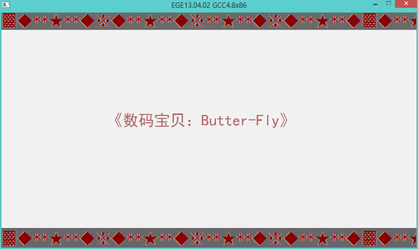
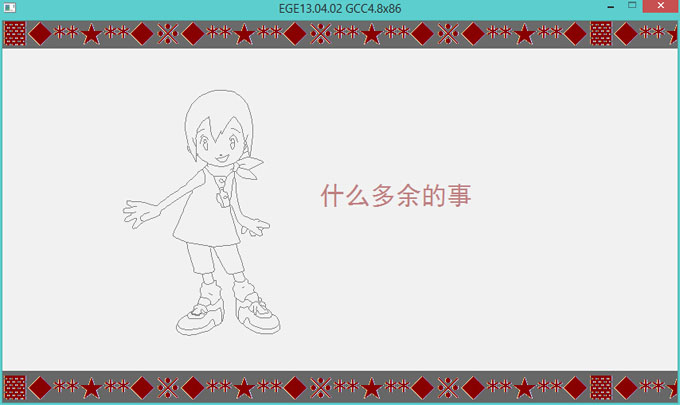
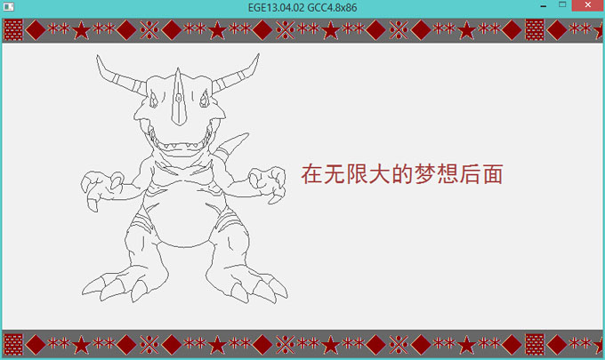
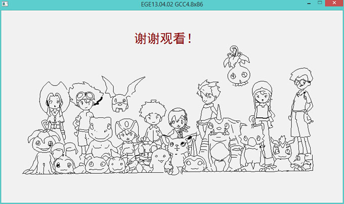
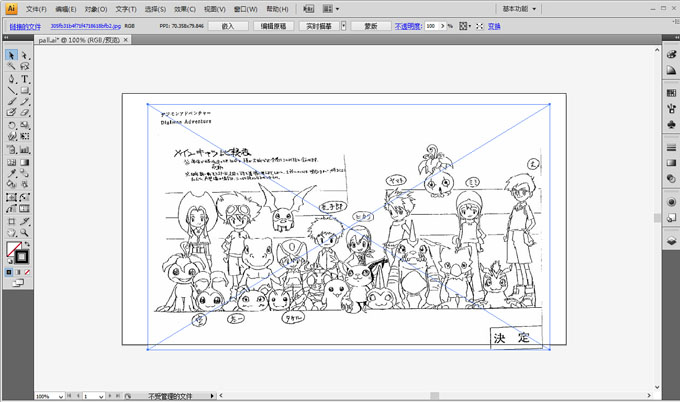
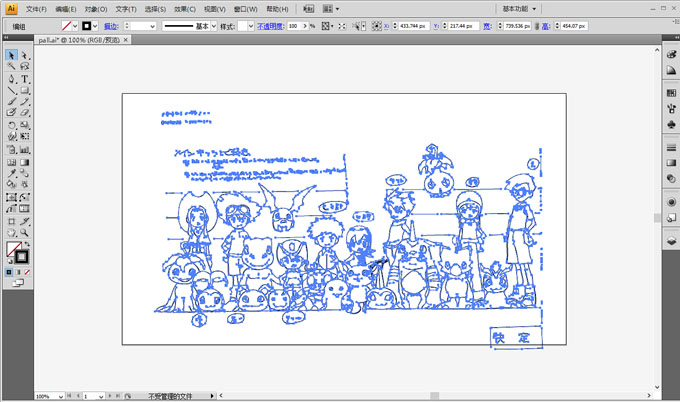
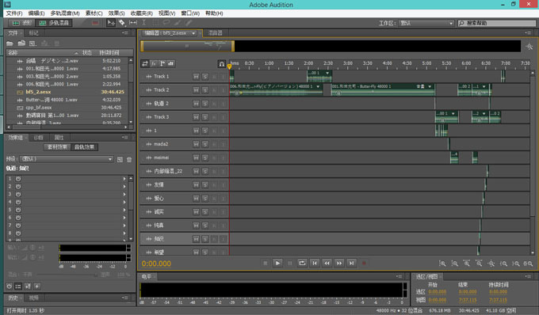

###一个用C++写的《数码宝贝》演示PV
-----------------------------------------------------------

[Readme English](https://github.com/Miantang/Ege-Butter-Fly/tree/master)

基于 [EGE (Easy Graphics Engine)](https://github.com/misakamm/xege), 是windows下的简易绘图库，是一个类似BGI(graphics.h)的面向C/C++语言新手的图形库，它的目标也是为了替代TC的BGI库而存在。

###如何获得

    git clone https://github.com/Miantang/Ege-Butter-Fly.git

或者 [Download Zip](https://github.com/Miantang/Ege-Butter-Fly/archive/master.zip)

你可以仅仅下载 Butter-Fly.exe 可执行程序和 Butter-Fly.wav 音频文件来快速观看。

###视频截图
-----------------------------------------------------------

  

 

 

 

###制作起因
-----------------------------------------------------------

闲暇有余，我参加了[网易云课堂](http://study.163.com/) 的[C++程序设计入门](http://mooc.study.163.com/course/BUPT-1000003015#/info).

当时课程中的一次绘图代码比赛，让我兴趣大增。同时，为了纪念[《数码宝贝》](http://baike.baidu.com/subview/18961/7578405.htm#viewPageContent) 十五周年，我决定开启了这次制作企划。

###我是怎么制作的
-----------------------------------------------------------

     C++ 开发环境 :  Dev-C++ version 5.6.0
     图源 :          百度贴吧 数码宝贝
     图形工具 :      Adobe Illustrator
     SVG 转换器 :    AsToEge
     音频工具 :      Adobe Audution

首先将JPG格式的图源用Adobe Illustrator编辑转换成SVG轮廓代码，并且精修部分矢量锚点，在848*480的图板上做好排版。

然后将修改后的SVG文件逐个通过自写的一个转换器[AsToEge](https://github.com/Miantang/AsToEge) 转出所需的Ege C++ 代码。

如图所示：

 

 
<embed src="Picture\pall.svg" width="80%"   
           type="image/svg-xml" />

将下载的MP3文件和《数码宝贝剧场版》视频，截取相关的独白和歌曲，用Adobe Audution剪辑合并成一个新的混音wav文件，同时按照时间轴制作一个lrc文件。

 

然后写相关的C++ 动画代码

由于我仅仅花费了三天左右的时间来完成这个PV，不可避免地会遇到一些不足的地方，并且代码本身应该也有缺陷。

如果你对这个制作感兴趣，欢迎联系我，或者Star 、Fork这个项目。

谢谢你的关注！

###如何联系我
-----------------------------------------------------------

    博客:   http://ppii.in
    邮箱:  peipenglu@163.com
    提交问题:  https://github.com/Miantang/Ege-Butter-Fly/issues

###许可证
-----------------------------------------------------------

使用 MIT License 
<http://www.opensource.org/licenses/mit-license.php>

